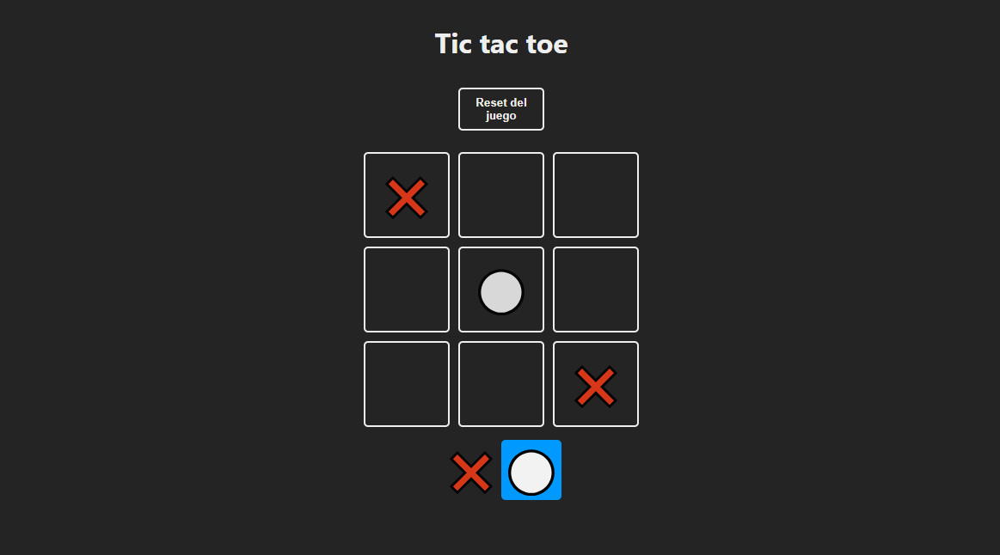

### TIC TAC TOE

**Índice**
- [Proyecto 🧩](#qué-es)
- [Tic Tac Toe 👾](#tic-tac-toe)
- [Tecnologías ⚙️](#tecnologías)
---

### Proyecto

Para refrescar todo lo aprendido estos últimos meses y aclarar conceptos de React, decidí hacer uno de los proyectos que suelen realizarse en algunos Bootcamps: el Tic Tac Toe, el tres en raya de toda la vida. Con un diseño sencillo y funcional. 

---

### Tic Tac Toe

### Tecnología

